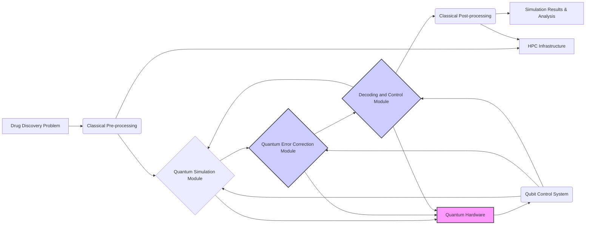

```markdown
## Technical Solution: QEC-Enhanced Quantum Simulations for Drug Discovery

### 1. System Architecture and Technical Design

This solution proposes a hybrid quantum-classical architecture that leverages the strengths of both quantum and classical computing. The architecture is designed to be modular and scalable, allowing for future integration of new QEC codes, decoding algorithms, and quantum hardware platforms.

**1.1. High-Level Overview**

The system consists of the following main components:

*   **Quantum Simulation Module:** Performs the actual quantum simulations of molecular interactions.
*   **Quantum Error Correction Module:** Encodes quantum states, detects and corrects errors during the simulation.
*   **Decoding and Control Module:** Responsible for real-time decoding of the QEC-protected quantum states, controls stabilizer measurements, and provides feedback to the quantum simulation.
*   **Classical Pre/Post-processing Module:** Handles data preparation, initial state preparation, result analysis, and data visualization.
*   **High-Performance Computing (HPC) Infrastructure:** Provides the necessary computational resources for classical simulations, decoding algorithms, and data analysis.
*   **Data Storage:** Securely stores quantum data, simulation results, and metadata.

**1.2. Detailed Design**



*   **Quantum Simulation Module:**
    *   Responsible for implementing quantum algorithms relevant to drug discovery, such as Variational Quantum Eigensolver (VQE) or Quantum Phase Estimation (QPE) for molecular simulations.
    *   Interacts directly with the quantum hardware and the QEC module.
    *   Requires careful optimization to minimize gate counts and circuit depth to reduce error accumulation.
*   **Quantum Error Correction Module:**
    *   Implements the chosen QEC code (e.g., surface code).
    *   Encodes logical qubits into physical qubits.
    *   Performs stabilizer measurements to detect errors.
    *   This module will likely be a combination of quantum circuits executed on the quantum hardware and classical control logic.
*   **Decoding and Control Module:**
    *   Receives stabilizer measurement results from the QEC Module.
    *   Runs a decoding algorithm (e.g., Minimum-Weight Perfect Matching, Belief Propagation) to infer the most likely error syndrome.
    *   Applies corrective operations to the quantum state based on the decoded error syndrome.
    *   The real-time requirement of this module necessitates a fast, low-latency implementation, potentially using specialized hardware like FPGAs.
*   **Classical Pre/Post-processing Module:**
    *   Handles data preparation, such as converting molecular structures into suitable quantum algorithm input formats.
    *   Performs post-processing of quantum simulation results, such as calculating molecular properties and predicting drug efficacy.
    *   Provides data visualization tools for researchers to analyze the results.
*   **HPC Infrastructure:**
    *   Provides the necessary computational resources for classical simulations, decoding algorithms, and data analysis.
    *   May include CPUs, GPUs, and specialized hardware accelerators.
*   **Data Storage:**
    *   Securely stores quantum data, simulation results, and metadata.
    *   Ensures data integrity and confidentiality.

### 2. Technology Stack and Tool Selection

*   **Quantum Hardware:**
    *   **Option 1: Superconducting Qubits:** Offers scalability and mature fabrication techniques.
        *   Vendors: IBM, Google, Rigetti.
    *   **Option 2: Trapped Ions:** Known for high fidelity and long coherence times.
        *   Vendors: IonQ, Quantinuum.
    *   *Justification:* The choice of quantum hardware depends on the specific application requirements and the availability of suitable hardware platforms. Both superconducting qubits and trapped ions are promising technologies, but superconducting qubits currently have a larger qubit count. Trapped ions have better fidelity.
*   **QEC Code:**
    *   **Surface Code:** A topological QEC code that is relatively robust to local errors and has a high error threshold.
    *   *Justification:* Surface codes are a leading candidate for practical QEC due to their fault-tolerance properties and relatively simple connectivity requirements.
*   **Decoding Algorithm:**
    *   **Minimum-Weight Perfect Matching (MWPM):** A widely used decoding algorithm for surface codes.
    *   **Belief Propagation:** An iterative decoding algorithm that can achieve higher accuracy than MWPM but may be more computationally expensive.
    *   *Justification:* MWPM is a good starting point due to its simplicity and relatively low computational complexity. Belief Propagation can be explored for higher accuracy, but requires more resources and careful tuning.
*   **Quantum Simulation Software:**
    *   **Qiskit (IBM):** An open-source quantum computing software development kit.
    *   **Cirq (Google):** Another open-source quantum computing software development kit.
    *   *Justification:* Both Qiskit and Cirq provide tools for designing, simulating, and executing quantum circuits. The choice depends on the preferred programming language and the specific features required.
*   **Classical Computing Software:**
    *   **Python:** A versatile programming language for data analysis, scientific computing, and machine learning.
    *   **NumPy, SciPy, scikit-learn:** Python libraries for numerical computation, scientific computing, and machine learning.
    *   **TensorFlow, PyTorch:** Deep learning frameworks for implementing and training machine learning models.
    *   *Justification:* Python is the dominant language in the scientific computing community, and these libraries provide a comprehensive set of tools for classical pre/post-processing and data analysis.
*   **FPGA (for real-time decoding):**
    *   Vendors: Xilinx, Intel.
    *   *Justification:* FPGAs provide the low-latency, high-throughput processing required for real-time decoding of QEC-protected quantum states.

### 3. Development Methodology and Timeline

*   **Agile Development:** Use an agile development methodology with short sprints and frequent releases.
    *   *Justification:* Agile allows for flexibility and adaptability to changing requirements and technical challenges.
*   **Timeline:**
    *   **Phase 1 (6 months):**
        *   Set up development environment and infrastructure.
        *   Implement basic surface code encoding and decoding.
        *   Develop classical pre/post-processing tools.
    *   **Phase 2 (6 months):**
        *   Implement advanced decoding algorithms (MWPM, Belief Propagation).
        *   Integrate QEC module with quantum simulation module.
        *   Optimize quantum circuits for drug discovery applications.
    *   **Phase 3 (6 months):**
        *   Develop and test fault-tolerant gate implementations.
        *   Implement real-time decoding on FPGAs.
        *   Validate the effectiveness of QEC through simulations.
    *   **Phase 4 (6 months):**
        *   Deploy the solution on quantum hardware platforms.
        *   Conduct rigorous testing and validation.
        *   Optimize the solution for performance and scalability.

### 4. Testing Strategy and Quality Assurance

*   **Unit Testing:** Test individual components of the system to ensure they function correctly.
    *   *Tools:* Python's `unittest` or `pytest` frameworks.
*   **Integration Testing:** Test the interaction between different components of the system.
*   **System Testing:** Test the entire system to ensure it meets the required accuracy and reliability.
*   **Performance Testing:** Measure the performance of the system under different workloads to identify bottlenecks and optimize performance.
*   **Error Rate Measurement:** Rigorously measure the logical error rate of the QEC-protected quantum computations. This is a critical metric for assessing the effectiveness of the QEC scheme.
*   **Validation against Classical Simulations:** Compare the results of QEC-enhanced quantum simulations with the results of classical simulations for small-scale systems. This helps to validate the accuracy of the quantum simulations.
*   **Fault Injection Testing:** Intentionally inject errors into the system to test the effectiveness of the QEC module.
*   **Code Reviews:** Conduct regular code reviews to ensure code quality and identify potential issues.
*   **Continuous Integration/Continuous Deployment (CI/CD):** Implement a CI/CD pipeline to automate the build, test, and deployment process.

### 5. Deployment and Scaling Considerations

*   **Cloud Deployment:** Deploy the solution on a cloud platform to provide access to quantum hardware and HPC resources.
    *   *Vendors:* AWS, Azure, Google Cloud.
    *   *Justification:* Cloud platforms provide scalability, flexibility, and cost-effectiveness.
*   **Containerization:** Use containers (e.g., Docker) to package the software components and ensure consistency across different environments.
*   **Microservices Architecture:** Decompose the system into smaller, independent microservices to improve scalability and maintainability.
*   **Horizontal Scaling:** Scale the system horizontally by adding more instances of each microservice.
*   **Load Balancing:** Distribute the workload across multiple instances of each microservice to improve performance and availability.
*   **Real-time Monitoring:** Implement real-time monitoring to track the performance of the system and identify potential issues.
*   **Qubit Count Scaling:** As quantum hardware improves, the system should be designed to easily incorporate more qubits into the QEC scheme. This will involve updating the encoding and decoding logic.
*   **Error Rate Reduction:** The QEC code and decoding algorithm may need to be updated as the physical qubit error rates improve. This is to optimize the performance and reduce the overhead of QEC.

### 6. Technical Risk Assessment and Mitigation

| Risk                               | Mitigation Strategy                                                                                                                                    |
| :--------------------------------- | :----------------------------------------------------------------------------------------------------------------------------------------------------- |
| QEC Implementation Complexity      | Partner with QEC experts, start with simpler QEC codes, and gradually increase complexity.                                                           |
| Hardware Limitations               | Carefully evaluate hardware platforms, choose QEC codes that are suitable for the available hardware, and monitor hardware developments.               |
| Decoding Complexity                | Optimize decoding algorithms, explore alternative decoding algorithms, and use specialized hardware (FPGAs) for real-time decoding.                   |
| Integration Challenges             | Develop robust integration tools, use standard APIs, and follow best practices for software engineering.                                                 |
| Cost Overruns                      | Develop a detailed budget, track expenses closely, and prioritize tasks.                                                                                |
| Security Vulnerabilities           | Implement a comprehensive security plan, follow security best practices, and conduct regular security audits.                                           |
| Insufficient Error Correction      | Monitor error rates and adapt QEC strategy if they are not sufficient. Explore code concatenation.                                                  |
| Scalability limits in decoding    | Explore distributed decoding algorithms and optimize communication between classical and quantum components.                                            |
| Fidelity limitations of gates/measurements | Explore error mitigation techniques to reduce the impact of imperfect gates.                                                                        |

This technical solution provides a comprehensive plan for implementing QEC to enhance quantum simulations for drug discovery. It addresses the key challenges and risks associated with QEC and provides a roadmap for achieving the desired business outcomes. The focus on practical implementation, scalability, and continuous monitoring will ensure that the solution remains effective and adaptable as quantum computing technology advances.
```